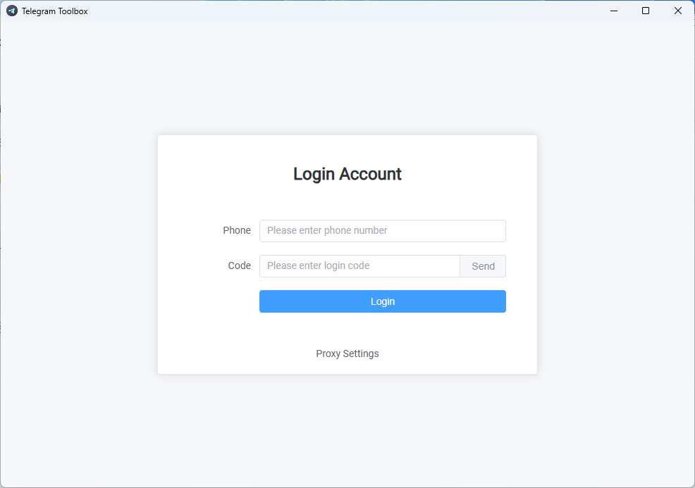

# Telegram Toolbox

## 📖 Intro
Telegram Toolbox is a powerful message management and automation tool designed for Telegram users, supporting Windows 10/11 64-bit systems. It integrates multiple practical features to help users efficiently monitor, forward, and manage Telegram messages, suitable for individuals, teams, and business scenarios.

Main features:
1. Keyword Monitoring: Customize keywords, and the system automatically scans Telegram messages.
2. Message Forwarding: Automatically forward messages to specified chats when triggered by keywords.
3. Real-time Notification: Instantly receive notifications when topics related to your business are mentioned.
4. Channel Finder: Automatically analyzes group links in messages and collects group information.
5. Member Export: Export group member lists for further contact and management.

Supported systems: Windows 10/11 64-bit  
Supported languages: Chinese, English

## 📦 Installation

Download：[GitHub](https://github.com/yee338024/telegram-toolbox/releases/download/1.0.3/telegram-toolbox-1.0.3-win-x64.exe)  
History Version：[Release](https://github.com/yee338024/telegram-toolbox/releases)

## 📱 Login

### Log in with your phone number and enter the verification code you receive.

