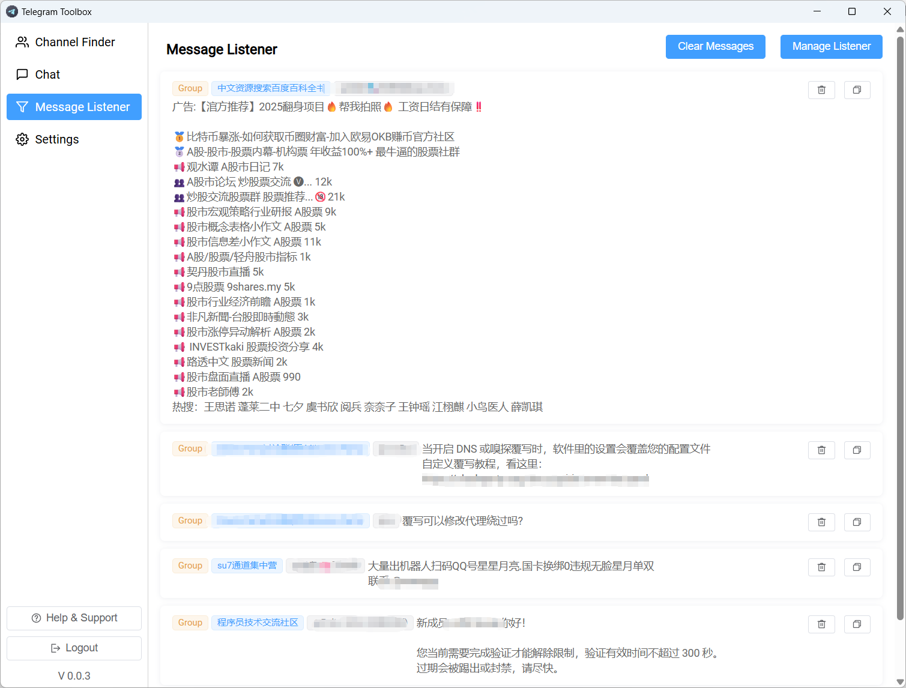
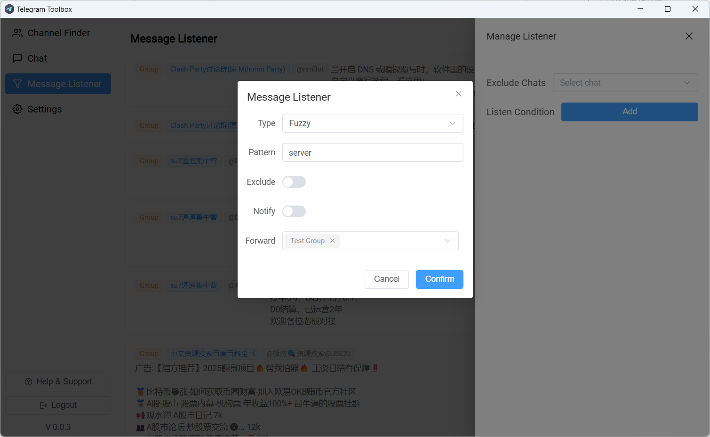

# Message Listener
#### 1.Go to `Message Listener` - `Manage Listener` to add a listener.

#### 2.Add the keywords you want to monitor.

##### Listener Type
- Exact Match: The keyword must match exactly.
- Fuzzy Match: The keyword can be part of a larger string.
- Regular Expression: Use regex patterns for advanced matching.
##### Exclude
If enable Exclude, will ignore the message that match the exclude keyword pattern.
##### Notify
If enable Notify, it will send a windows notification(with sound) when a message match keyword pattern.
##### Forward
If enable Forward, it will forward the message that match keyword pattern to the specified chat.

