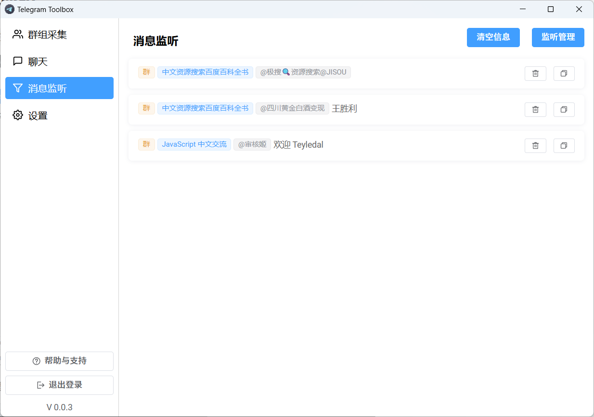
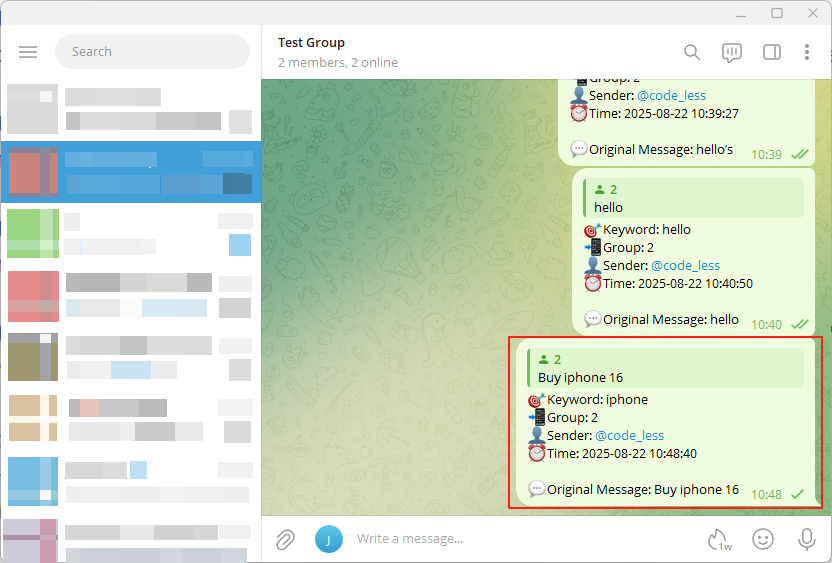

# 消息监听

#### 1. 进入 `消息监听` - `监听管理` 添加监听。

#### 2. 添加你想要监控的关键词。

##### 监听类型
- 精确匹配：关键词需完全匹配。
- 模糊匹配：关键词可作为消息内容的一部分。
- 正则表达式：使用正则表达式进行高级匹配。
##### 排除
启用排除后，会排除匹配关键词的消息。
##### 提醒
启用通知后，匹配关键词的消息会弹出 Windows 通知（带声音）。
##### 转发
启用转发后，匹配关键词的消息会自动转发到指定聊天。

