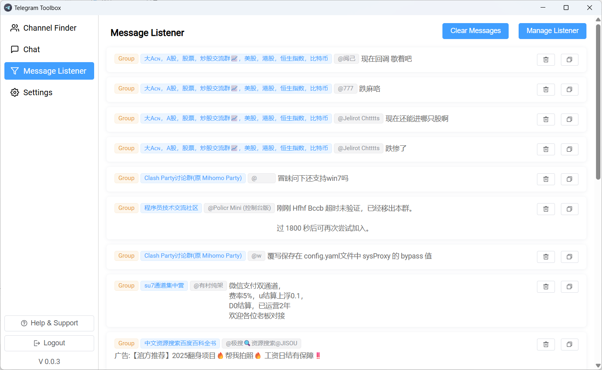

# Telegram Toolbox

**Telegram Toolbox** — это умный инструмент для поиска потенциальных клиентов в Telegram. 
Он отслеживает сообщения в группах и каналах, обнаруживает важные **ключевые слова** и мгновенно уведомляет вас, помогая находить и связываться с новыми лидами.

## 🚀 Основные функции

### Мониторинг ключевых слов

Настройте свои ключевые слова, и система будет автоматически сканировать сообщения Telegram.

### Пересылка сообщений
Автоматически пересылайте важные сообщения в выбранный чат или группу.

### Поиск групп и каналов
Автоматически собирает информацию о группах и каналах из сообщений или профилей пользователей, облегчая поиск, организацию и управление целевыми сообществами для вашего бизнеса или комьюнити.

---

## 🎯 Примеры использования

- **Продажи и маркетинг** — Поиск потенциальных покупателей по отслеживаемым ключевым словам.
- **Управление сообществом** — Мониторинг обсуждений для быстрого взаимодействия с участниками.
- **Исследования и тренды** — Отслеживание разговоров о продуктах, брендах или конкурентах.

---

