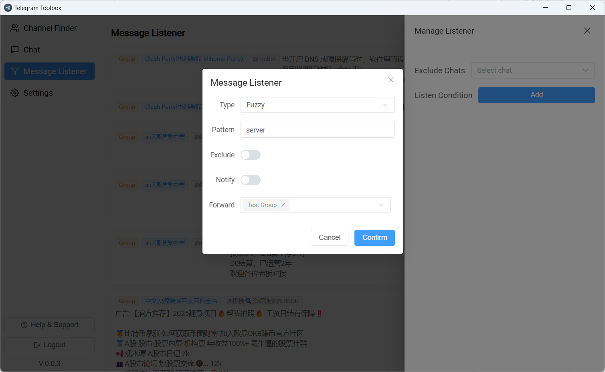

# Telegram Toolbox

<div style="text-align:center">

</div>

**Telegram Toolbox** 是一款`开源`监听、采集工具，帮助你在 Telegram 上捕捉潜在客户。
它会监听群组和频道消息，检测你添加的**关键词**，并即时通知你，让你更容易发现和联系新线索，用户`无需服务器`，只要在本地电脑安装就能运行。

需要定制功能联系我：  


## ⬇️ 下载安装
从 [Releases](https://github.com/yee338024/telegram-toolbox/releases) 页面下载最新版本


## 🚀 主要功能

#### 消息监听
自定义关键词，系统自动扫描 Telegram 消息。


### 消息转发

自动将重要消息转发到指定的聊天或群组。


### 群组采集

可自动从用户消息或用户资料中采集聊天群组信息，帮助你更高效地发现、整理和管理目标群组。


---

## 🎯 应用场景

- **销售与营销** – 通过追踪行业关键词发现潜在买家。
- **社区管理** – 监控群组讨论，快速与成员互动。
- **调研与趋势** – 跟踪产品、品牌或竞争对手相关话题。

---

##   使用教程


如果是中国大陆地区的用户需要设置下代理，代理服务器和端口，需要根据代理软件设置来填写，如果开启了全局代理，可以跳过该步骤。

3. 再到`消息监听`-`监听管理`，添加监听关键词监听即可


## 代码启动
1. 克隆仓库
```shell
git clone https://github.com/yee338024/telegram-toolbox.git
```
2. 安装依赖
进入 `telegram-toolbox-client` 目录
```shell
npm install
```
进入 `telegram-toolbox-vue` 目录
```shell
npm install
```
3. 启动
先启动前端，进入 `telegram-toolbox-vue` 目录
```shell
npm run dev
```
再启动electron，进入 `telegram-toolbox-client` 目录
```shell
npm run dev
```
